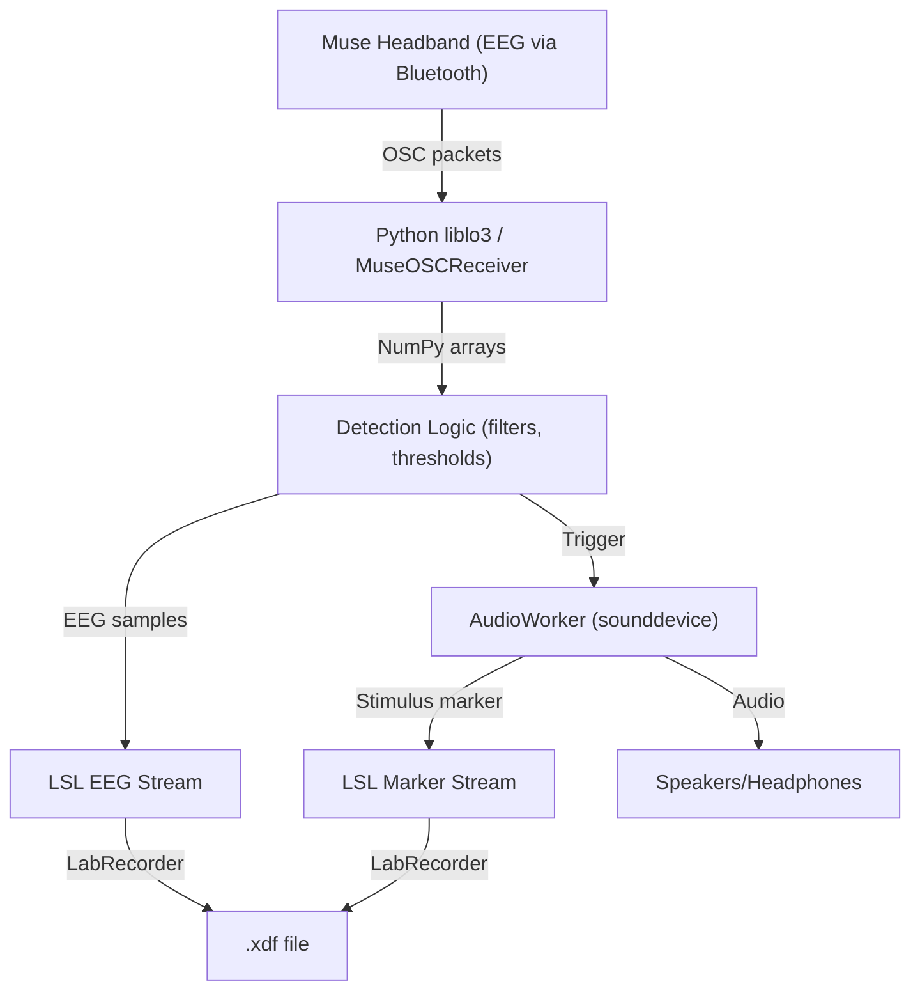

# Real-Time Closed-Loop EEG-Triggered Auditory Stimulation

**A modular Python toolkit for real-time closed-loop EEG experiments with Muse headband, LSL, and low-latency auditory stimulation.**

---

## Features
- **Live EEG acquisition** from Muse headband (Bluetooth/OSC)
- **Real-time signal processing** and event detection (e.g., amplitude, oscillations)
- **Low-latency auditory stimulation** (e.g., pink noise bursts) on detected events
- **Precise event marking** via [Lab Streaming Layer (LSL)](https://github.com/labstreaminglayer/pylsl), enabling synchronized EEG and event logs
- **Easy visualization**: static and live dashboards (Matplotlib, PyQtGraph)
- **Modular**: Each component is reusable and hackable for your experiment

---

## Architecture Overview



---

## Installation

1. **Clone this repository**:
   ```bash
   git clone wolfgang-ganglberger/muse-closedloop-stim.git
   cd muse-closedloop-stim
   ```
2. **Set up environment** (recommended: [conda](https://docs.conda.io/en/latest/miniconda.html)):
   ```bash
   conda create -n muse python=3.10 -y
   conda activate muse
   pip install -r requirements.txt
   ```
   Or install required packages manually:
   ```bash
   pip install numpy matplotlib sounddevice pylsl pyliblo3 pyqtgraph
   ```
3. **(Optional) Install LabRecorder** for synchronized data logging:  
   [LabRecorder download](https://github.com/labstreaminglayer/App-LabRecorder/releases)

---

## ⚡ Quickstart

### 1. **Demo: Data Collection and Visualization**
```bash
source activate muse
python live_dashboard.py
```
This will:
- Start collecting data from your Muse headband (ensure it is paired and streaming via OSC)
- Plot a static snapshot, then launch a live dashboard (EEG, PPG, ACC)

### 2. **Run Closed-Loop Experiment**
```bash
source activate muse
python run_closedloop.py
```
or shell wrapper
```bash
./run_closedloop.sh
```

What happens:
	•	osc_receiver.py ingests Muse OSC and buffers signals
	•	lsl_interface.py streams EEG to LSL (visible to LabRecorder)
	•	event_detection.py detects events in real time
	•	stimulus_player.py plays stimulus and pushes StimMarkers to LSL
	•	Record EEG + markers in LabRecorder → .xdf for offline analysis
---

## Repository Layout

```
muse-closedloop-stim/
├── .gitignore
├── README.md
├── requirements.txt
├── demo_datacollection.sh       # (optional) convenience wrapper
├── run_experiment.sh            # (optional) convenience wrapper
├── run_closedloop.py            # main closed-loop runner (Python)
├── live_dashboard.py            # static + live visualization
├── osc_receiver.py              # Muse OSC acquisition (buffers + timestamps)
├── lsl_interface.py             # LSL EEG + marker outlets, streaming helpers
├── event_detection.py           # real-time detection logic (filters, thresholds)
├── stimulus_player.py           # audio playback + LSL marker push
├── time_regularization.py       # regularize timestamps to uniform grid
└── sandbox/                     # (optional) scratch, notebooks, temp assets
```

---

## 🏗️ How It Works

1. **Acquisition (osc_receiver.py)**:  
   Receives Muse OSC bursts (EEG/PPG/ACC), assigns uniform timestamps (PLL clock aligned to LSL if configured), and exposes ring buffers.
2. **Streaming (lsl_interface.py)**:  
   Pushes EEG into an LSL EEG stream (MuseEEG), visible to LabRecorder and other LSL clients.
3. **Detection (event_detection.py)**:  
   Pulls recent EEG, applies causal Butterworth band-pass, thresholding, and refractory logic. On detection, emits a trigger timestamp.
4. **Stimulation & Marking (stimulus_player.py)**:  
   Builds a stimulus (pink noise or Morlet) and plays it via sounddevice. Simultaneously pushes an LSL StimMarkers sample.
5. **Recording (LabRecorder)**:  
   Record both EEG and StimMarkers streams to a single .xdf for synchronized offline analysis.

---

## Module Overview

- **osc_receiver.py**  
  Lightweight, thread-safe OSC receiver for Muse data. Buffers all streams (EEG, PPG, ACC, etc.).
- **lsl_interface.py**  
  Streams EEG (and optionally other signals) to LSL. Supports chunked streaming for high performance.
- **event_detection.py**  
  Real-time detection: applies causal bandpass filter, thresholds, and refractory logic.
- **stimulus_player.py**  
  Plays pre-generated pink noise or Morlet wavelets on trigger; pushes LSL marker with precise timestamp.
- **live_dashboard.py**  
  Collects, processes, and visualizes data. Includes static Matplotlib plots and a live PyQtGraph dashboard.
- **time_regularization.py**  
  Ensures uniformly spaced timestamps, handles dropped packets/gaps, inserts NaNs as needed.
- **run_closedloop.py**  
  Orchestrates the full closed-loop pipeline: acquisition, detection, stimulation, and LSL streaming.

---

## Configuration Tweaks

	•	Time base: keep everything in LSL time (recommended) so EEG and markers share one clock domain.
	•	Detector: adjust band, thresh_uV, and refractory_s in event_detection.py.
	•	Stimulus: choose pink or other noise types, and tune stim_dur, stim_rms in stimulus_player.py (and/or where constructed in run_closedloop.py).
	•	Channels & names: configure EEG channel list / LSL stream names in lsl_interface.py.

---

## Troubleshooting

- **No data received**:  
  - Ensure Muse headband is paired and streaming OSC (try Muse Monitor or similar).
  - Make sure UDP port (default 7000) is free (the code attempts to free it automatically).
- **No LSL streams in LabRecorder**:  
  - Check that `lsl_modules.py` is running and not blocked by firewall.
  - Confirm that LabRecorder is set to record the correct streams ("MuseEEG", "StimMarkers").
- **No audio output**:  
  - Check your system's audio device settings.
  - Try running a simple `sounddevice` test.
- **Timing issues**:  
  - Use the provided timestamp correction utilities.
  - Check system latency (see comments in code).


